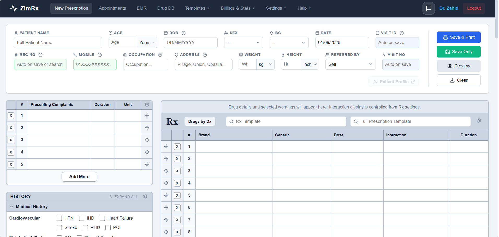

<p align="center">
  
</p>

<h1 align="center">ZimRx</h1>

<p align="center">
  <b>Privacy-First, Local-First Digital Prescription & EMR Suite</b><br>
  <i>Built for solo physicians, medical practitioners, and clinics in low-resource and low-connectivity regions.</i>
</p>

<p align="center">
  <a href="https://www.gnu.org/licenses/agpl-3.0"></a>
  <a href="#architecture--data-sovereignty"></a>
  <a href="https://www.php.net/"></a>
  <a href="https://frankenphp.dev/"></a>
</p>

---


*A preview of the ZimRx ultra-fast Prescription Grid UI*

> 📹 **Prototype Demo**: [Watch the Prototype Video (preview/prototype-preview.mp4)](preview/prototype-preview.mp4) — *A demonstration of the doctor-friendly, ultra-fast prescription workflow.*

---

**ZimRx** is an open-source, high-performance digital prescription and Electronic Medical Record (EMR) system built for solo doctors, medical practitioners, and clinics in low-resource or bandwidth-constrained regions. Built on a strict **local-first philosophy**, ZimRx runs 100% offline, eliminates recurring SaaS subscription costs, and guarantees complete patient data privacy and sovereignty.

---

## ✨ Key Features

* **⚡ 100% Offline & Portable**: Runs anywhere without an internet connection using a self-contained portable runtime (powered by FrankenPHP and Caddy). Launchable with a single double-click directly from a USB flash drive or laptop with zero installation overhead.
* **⌨️ Ultra-Fast Grid UI**: Custom-engineered, lightweight Prescription Grid UI built with pure Vanilla JS and CSS tokens. Entirely keyboard-driven (Tab & Arrow keys) to eliminate mouse fatigue, allowing doctors to compose an error-free prescription in under 20–30 seconds.
* **💊 Sub-Millisecond Pharmaceutical Search**: Instant full-text search across 30,000+ national commercial drug brands, formulations, strengths, and generic equivalents powered by SQLite FTS5.
* **🛡️ Clinical Decision Support (CDS)**: Built-in safety checks for drug-drug interactions, pregnancy & lactation contraindications, renal/hepatic adjustments, and pediatric dosage calculators.
* **📋 Rapid Consultation Workflow**: Streamlined interface for presenting complaints, vitals, medical history, physical examinations, diagnostic investigations, and individualized patient advice templates.
* **🖨️ Pixel-Perfect Print Formatting**: Highly customizable prescription pad layout engine supporting custom doctor headers, clinic logos, multi-column formatters, and watermark overlays for standard A4/A5 or thermal printers.
* **🔌 Driver-Agnostic Central PDO Core**: Database abstraction layer with automated, versioned schema migrations (`DbMigrator`), allowing seamless operation on SQLite locally, or scaling to MariaDB, MySQL, and PostgreSQL for multi-user hospital networks.

---

## 🏛️ Architecture & Data Sovereignty

Patient health records should **never** be monetized, tracked, or leaked to centralized third-party clouds.

```
┌─────────────────────────────────────────────────────────────┐
│                       ZimRx Client                          │
│          (Vanilla JS + Modern CSS Design Tokens)            │
└──────────────────────────────┬──────────────────────────────┘
                               │
                               ▼
┌─────────────────────────────────────────────────────────────┐
│            Portable Web Server & PHP Runtime                │
│                 (FrankenPHP + Caddy Core)                   │
└──────────────────────────────┬──────────────────────────────┘
                               │ Central PDO Abstraction
                               ▼
┌──────────────────┬───────────────────────┬──────────────────┐
│   zimrx_drugs    │     zimrx_static      │  zimrx_userdata  │
│  (30k+ Catalog   │  (Standard DX / IX /  │  (Doctor EMR &   │
│  & Interactions) │    Examinations)      │  Patient Visits) │
└──────────────────┴───────────────────────┴──────────────────┘
```

* **Zero Cloud Lock-in**: All patient encounters, appointments, and billing data stay strictly inside `application/userdata/`.
* **Zero Telemetry**: No tracking pixels, no analytics backdoors, and no remote surveillance.

---

## 🚀 Quick Start (Windows)

1. **Download or Clone the Repository**:
   ```bash
   git clone https://github.com/aliffarzanzim/zimrx.git
   ```
2. Double-click **`start.bat`** (it will automatically configure the FrankenPHP runtime if needed).
3. ZimRx automatically opens in your browser at `http://localhost:8080`.

---

## 🛠️ Development & Deployment

### Requirements
* PHP 8.2+ with PDO SQLite extension (or Docker / FrankenPHP)
* Caddy / Apache / Nginx (optional for production web servers)

### Automated Setup for Developers
Windows developers can run the included setup script to configure FrankenPHP and required extensions with one click:
```cmd
setup-franken-for-dev.bat
```

### Database Migrations
Database schemas and versioning are managed through `DbMigrator.php`. Run the application or execute `db.php` to apply any pending schema migrations automatically:
```bash
php -r "require_once 'application/db.php';"
```

---

## 🗺️ Roadmap & Upcoming Features

ZimRx is actively under development. Our immediate technical roadmap includes:
* **🔐 Cryptographic Delta-Updates**: 15–30 KB differential SQL patches for low-bandwidth database syncing (cryptographically signed and verified via Libsodium Ed25519).
* **📺 Smart TV Waiting Room Dashboard**: Live, anonymized token tracking and ethical queue management for clinic waiting areas.
* **🔤 Native Bengali Transliteration**: In-app phonetic typing engine (Avro-compatible) to remove reliance on OS-level keyboard bloatware.
* **📟 Hardware Normalization**: ESC/POS dialect translation for thermal receipt printers and barcode buffer normalization for unstandardized clinic hardware.
* **📈 Dynamic Pediatric Growth Charts**: Multi-visit child growth plotting against WHO and CDC Z-score curves.
* **📦 Multi-Platform Packaging**: Pre-built one-click standalone distributions for Windows, Linux, macOS, and Docker.

---

## 🤝 Acknowledgements & Special Thanks

Heartfelt gratitude to the contributors and researchers who supported the ZimRx medical intelligence and pharmaceutical database:

### 💊 Drug Database Contributions
* **Sifat Islam**
* **Sifat Bin Siddique Urfi** *(DMC K-79)*
* **Yeamin Faiaj**
* **Azithromycin**
* **Sauda Noor Sara** *(NMC)*
* **Sohaila Raida** *(CMC)*
* **Asif Iqbal** *(KMC K31)*
* **Shamsul** *(RpMC)*
* **Ramisa Subah** *(CMC)*
* **Mahbub, The Dark Lord**
* **Jaowad Arham**

### 🔬 Drug Interaction & Research Concept
* **Saif** — for pioneering drug interaction research ideas and clinical logic.

---

## ⚖️ License & Medical Data Attribution

### 💻 Software Code (GNU AGPLv3)
ZimRx application source code, UI components, database migration engine (`DbMigrator`), and backend APIs are licensed under the **[GNU Affero General Public License v3.0 (AGPL-3.0)](LICENSE)**.

### 📋 Clinical Catalogs & Data Aggregation
The standalone reference databases bundled in `application/assets/database/` are distributed alongside the software under a mere aggregation model:
* **Presenting Complaints (`zimrx_static_pc`)**: 
  The medical terminology catalogs represent standard, public clinical vocabulary curated from standard medical literature & textbooks, clinical practitioner notes, and the **SNOMED CT Global Patient Set (GPS)** for workflow efficiency and rapid autocomplete. They do not incorporate proprietary code systems or relational ontologies. Applicable SNOMED descriptions are used under the SNOMED International GPS Open License:
  > *"This material includes SNOMED Clinical Terms ® (SNOMED CT ®) which is used by permission of SNOMED International. All rights reserved. SNOMED CT ® was originally created by the College of American Pathologists."*
* **Pharmaceutical Catalog**: Curated from public national pharmacopoeias, clinical formularies, open drug registries, and standard medical & pharmacology reference and textbooks.
