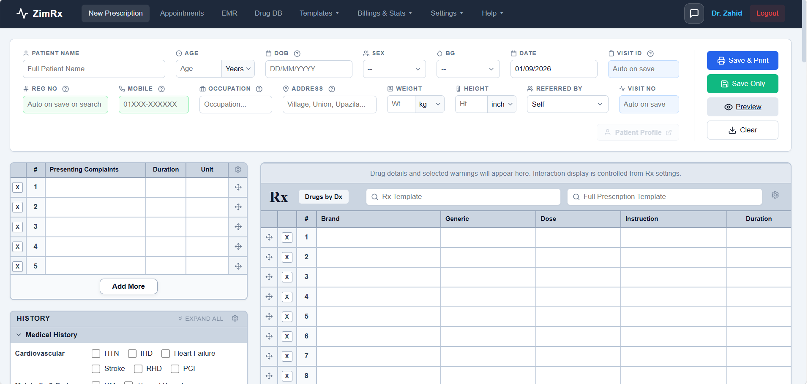

<p align="center">
  
</p>

<h1 align="center">ZimRx</h1>

<p align="center">
  <b>Privacy-First, Local-First Digital Prescription & EMR Suite</b><br>
  <i>Built for solo physicians, medical practitioners, and clinics in low-resource and low-connectivity regions.</i>
</p>

<p align="center">
  <a href="https://www.gnu.org/licenses/agpl-3.0"></a>
  <a href="#architecture--data-sovereignty"></a>
  <a href="https://www.php.net/"></a>
  <a href="https://frankenphp.dev/"></a>
</p>

---


*A preview of the ZimRx ultra-fast Prescription Grid UI*

> **Prototype Demo**: [Watch the Prototype Video (preview/prototype-preview.mp4)](preview/prototype-preview.mp4) - *Demonstration of the doctor-friendly, ultra-fast prescription workflow.*

---

**ZimRx** is an open-source, local-first, high-performance digital prescription and Electronic Medical Record (EMR) system built for solo doctors, medical practitioners, and clinics in low-resource or bandwidth-constrained regions. Built on a strict local-first philosophy, ZimRx is designed for fully air-gapped and offline environments with zero external network dependencies, eliminates recurring SaaS subscription costs, and guarantees complete patient data privacy and sovereignty.

---

## Key Features

* **100% Air-Gapped & Portable**: Operates entirely offline without an internet connection using a self-contained portable runtime (powered by FrankenPHP and Caddy). Launchable with a single double-click directly from a USB flash drive or laptop with zero installation overhead.
* **Open Data Portability & Sovereignty**: Export complete patient clinical histories, visit notes, and records into standardized open formats (JSON / CSV) at any time with zero vendor lock-in.
* **Ultra-Fast Grid UI**: Custom-engineered, lightweight Prescription Grid UI built with pure Vanilla JS and CSS tokens. Entirely keyboard-driven (Tab & Arrow keys) to eliminate mouse fatigue, allowing doctors to compose an error-free prescription in under 20-30 seconds.
* **Sub-Millisecond Pharmaceutical Search**: Instant full-text search across 30,000+ national commercial drug brands, formulations, strengths, and generic equivalents powered by SQLite FTS5.
* **Clinical Decision Support (CDS)**: Built-in safety checks for drug-drug interactions, pregnancy & lactation contraindications, renal/hepatic adjustments, and pediatric dosage calculators.
* **Rapid Consultation Workflow**: Streamlined interface for presenting complaints, vitals, medical history, physical examinations, diagnostic investigations, and individualized patient advice templates.
* **Pixel-Perfect Print Formatting**: Highly customizable prescription pad layout engine supporting custom doctor headers, clinic logos, multi-column formatters, and watermark overlays for standard A4/A5 or thermal printers.
* **Driver-Agnostic Central PDO Core**: Database abstraction layer with automated, versioned schema migrations (`DbMigrator`), allowing seamless operation on SQLite locally, or scaling to MariaDB, MySQL, and PostgreSQL for multi-user hospital networks.

---

## Architecture & Data Sovereignty

Patient health records should **never** be monetized, tracked, or leaked to centralized third-party clouds.

```
┌─────────────────────────────────────────────────────────────┐
│                       ZimRx Client                          │
│          (Vanilla JS + Modern CSS Design Tokens)            │
└──────────────────────────────┬──────────────────────────────┘
                               │
                               ▼
┌─────────────────────────────────────────────────────────────┐
│            Portable Web Server & PHP Runtime                │
│                 (FrankenPHP + Caddy Core)                   │
└──────────────────────────────┬──────────────────────────────┘
                               │ Central PDO Abstraction
                               ▼
┌──────────────────┬───────────────────────┬──────────────────┐
│   zimrx_drugs    │     zimrx_static      │  zimrx_userdata  │
│  (30k+ Catalog   │  (Standard DX / IX /  │  (Doctor EMR &   │
│  & Interactions) │    Examinations)      │  Patient Visits) │
└──────────────────┴───────────────────────┴──────────────────┘
```

* **Zero Cloud Lock-in**: All patient encounters, appointments, and billing data stay strictly inside `application/userdata/`.
* **Zero Telemetry**: No tracking pixels, no analytics backdoors, and no remote surveillance.

### Directory Architecture & Security Boundaries

Standard web frameworks rely on pointing the web server's DocumentRoot to a `/public` folder to keep source code and databases out of the web path. While that is effective on dedicated servers, it breaks "drop-in" portability for non-technical doctors using USB drives, portable runtimes, or local setups (like XAMPP) where modifying virtual host configurations is difficult or impossible for them.

ZimRx balances instant plug-and-play portability with strict security boundaries through directory-level access controls:

* **`application/userdata/` (Isolated Clinic Vault)**:
  Contains all mutable state—SQLite databases, encrypted backups, user uploads, and cache. 
  * *Why this design*: A doctor can back up, clone, or migrate their entire clinic practice simply by copying this single folder to a flash drive, eliminating database dump scripts or cloud dependencies.
  * *Security*: Non-media subdirectories (`database/`, `backups/`, `cache/`) are strictly blocked from HTTP requests via `.htaccess` (`Require all denied`) and Caddyfile route blocks.
* **`application/lib/` & `application/db/` (Core Engine & PDO Migrations)**:
  Houses the database abstraction layer, query builders, and automated migration engine (`DbMigrator`). Direct execution via browser URL is barred by web server rules and code-level entry guards.
* **`application/api/` (Controlled RPC Gateway)**:
  All frontend communication routes through here. Every endpoint enforces active session checks, CSRF token verification, and doctor data isolation.
* **`application/assets/` (Zero-Build Frontend Layer)**:
  Clean 3-tier presentation structure (`layout/`, `modules/`, `pages/`) using native CSS tokens and vanilla JavaScript. Eliminates Node/NPM build pipelines, so files can be inspected, customized, and run offline without compile steps.

> **Roadmap Note**: For high-security institutional and hospital LAN deployments where dedicated IT staff manage the web server, a native `public/` document-root separation mode is planned in future alongside MariaDB/PostgreSQL multi-user support.


---

## Deployment Scope & Global Adaptability

* **Cross-Border Scalability & Decoupled Formularies**: While currently being developed in Bangladesh, ZimRx is architected from the ground up for cross-border adoption. Generic names, class, indications are strictly decoupled from commercial brand names in the database, allowing international clinics, health services, or humanitarian teams to operate on Day 1 in generic-prescribing mode. Developers and medical contributors from other countries can easily plug in, customize, or maintain their own national drug formularies without altering the application core.
* **Humanitarian Aid & Crisis Relief Ready**: Released under the copyleft **GNU AGPLv3** license, ZimRx provides medical teams and humanitarian organizations (such as *Médecins Sans Frontières*) with a zero-cost, resilient clinical prescribing engine that operates reliably in disaster response zones, refugee health posts, and rural clinics during complete telecommunication or power blackouts.
* **Privacy by Design & Data Sovereignty**: Operates on a strict local-first, zero-telemetry model aligned with global privacy standards (GDPR, medical confidentiality). Sensitive patient health records remain strictly on local clinic hardware, entirely eliminating exposure to commercial cloud providers, telemetry backdoors, and recurring subscription lock-in.
* **Modern Edge Infrastructure**: Powered by **[FrankenPHP](https://frankenphp.dev/)** and Caddy core, delivering a self-contained, single-binary execution environment that runs natively on budget laptops and clinic edge hardware without external database or web server configuration.

---

## Quick Start (Windows)

1. **Download or Clone the Repository**:
   ```bash
   git clone https://github.com/aliffarzanzim/zimrx.git
   ```
2. Double-click **`start.bat`** (it will automatically configure the FrankenPHP runtime if needed).
3. ZimRx automatically opens in your browser at `http://localhost:8080`.

---

## Development & Deployment

### Requirements
* PHP 8.2+ with PDO SQLite extension (or Docker / FrankenPHP)
* Caddy / Apache / Nginx (optional for production web servers)

### Automated Setup for Developers
Windows developers can run the included setup script to configure FrankenPHP and required extensions with one click:
```cmd
setup-franken-for-dev.bat
```

### Database Migrations
Database schemas and versioning are managed through `DbMigrator` (`application/db/db_migrator.php`). Run the application or execute `db.php` to apply any pending schema migrations automatically:
```bash
php -r "require_once 'application/db.php';"
```

### Automated Test Suite
ZimRx includes an automated security, SQLite concurrency, and clinical calculation test suite:
```bash
php application/tests/run_tests.php
```

---

## Roadmap & Upcoming Features

ZimRx is actively under development. Our immediate technical roadmap includes:
* **Cryptographic Delta-Updates**: 15-30 KB differential SQL patches for low-bandwidth database syncing (cryptographically signed and verified via Libsodium Ed25519).
* **Smart TV Waiting Room Dashboard**: Live, anonymized token tracking and ethical queue management for clinic waiting areas.
* **Native Bengali Transliteration**: In-app phonetic typing engine (Avro-compatible) to remove reliance on OS-level keyboard bloatware.
* **Hardware Normalization**: ESC/POS dialect translation for thermal receipt printers and barcode buffer normalization for unstandardized clinic hardware.
* **Dynamic Pediatric Growth Charts**: Multi-visit child growth plotting against WHO and CDC Z-score curves.
* **Multi-Platform Packaging**: Pre-built one-click standalone distributions for Windows, Linux, macOS, and Docker.

---

## Acknowledgements & Special Thanks

Heartfelt gratitude to the contributors and researchers who supported the ZimRx medical intelligence and pharmaceutical database:

### Drug Database Contributions
* **Sifat Islam**
* **Sifat Bin Siddique Urfi** *(DMC K-79)*
* **Yeamin Faiaj**
* **Azithromycin** *(Pseudonym - Guess The Case Community Member)*
* **Sauda Noor Sara** *(NMC)*
* **Sohaila Raida** *(CMC)*
* **Asif Iqbal** *(KMC K31)*
* **Shamsul** *(RpMC)*
* **Ramisa Subah** *(CMC)*
* **Mahbub ("The Dark Lord")** *(Pseudonym - Guess The Case Community Member)*
* **Jaowad Arham**

### Drug Interaction & Research Concept
* **Saif** - for pioneering drug interaction research ideas and clinical logic.

---

## Clinical Disclaimer & Regulatory Status

**ZimRx is strictly an assistive administrative workflow and clinical recordkeeping tool. It is not an autonomous medical device, nor does it provide automated medical diagnoses or treatment decisions.**

- **Physician Responsibility:** All clinical decision support features, including drug-drug interaction alerts, pediatric dose calculations, and contraindication warnings, serve purely as evidence-based informational reference aids.
- **Professional Oversight:** Final clinical evaluation, diagnostic judgment, and prescribing authority rest solely and exclusively with the attending licensed medical practitioner.
- **No Warranty:** In accordance with the GNU AGPL-3.0 license, this open-source software is provided "as is", without warranty of any kind. Clinicians must independently verify all pharmacological doses, contraindications, and patient parameters prior to administering or prescribing any medical therapy.

---

## License & Medical Data Attribution

### Software Code (GNU AGPLv3)
ZimRx application source code, UI components, database migration engine (`DbMigrator`), and backend APIs are licensed under the **[GNU Affero General Public License v3.0 (AGPL-3.0)](LICENSE)**.

### Clinical Catalogs & Data Aggregation
The standalone reference databases bundled in `application/assets/database/` are distributed alongside the software under a mere aggregation model:
* **Presenting Complaints (`zimrx_static_pc`)**: 
  The medical terminology catalogs represent standard, public clinical vocabulary curated from standard medical literature & textbooks, clinical practitioner notes, and the **SNOMED CT Global Patient Set (GPS)** for workflow efficiency and rapid autocomplete. They do not incorporate proprietary code systems or relational ontologies. Applicable SNOMED descriptions are used under the SNOMED International GPS Open License:
  > *"This material includes SNOMED Clinical Terms ® (SNOMED CT ®) which is used by permission of SNOMED International. All rights reserved. SNOMED CT ® was originally created by the College of American Pathologists."*
* **Pharmaceutical Catalog**: Curated from public national pharmacopoeias, clinical formularies, open drug registries, and standard medical & pharmacology reference and textbooks.

